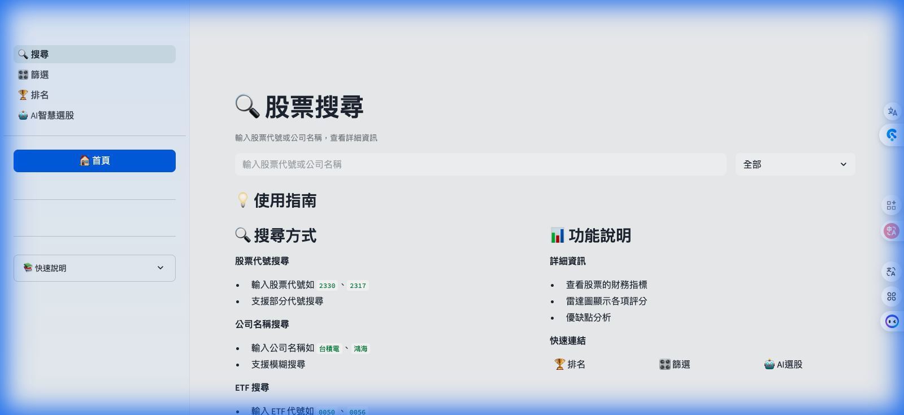
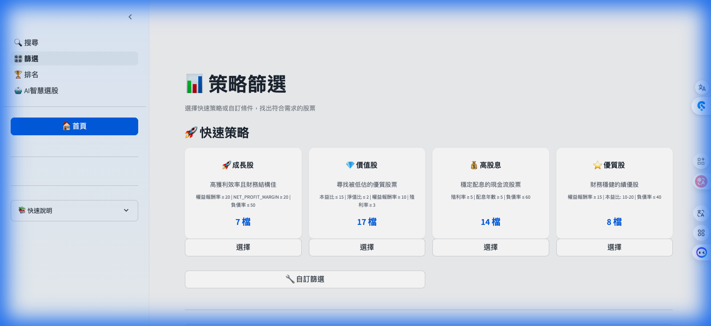
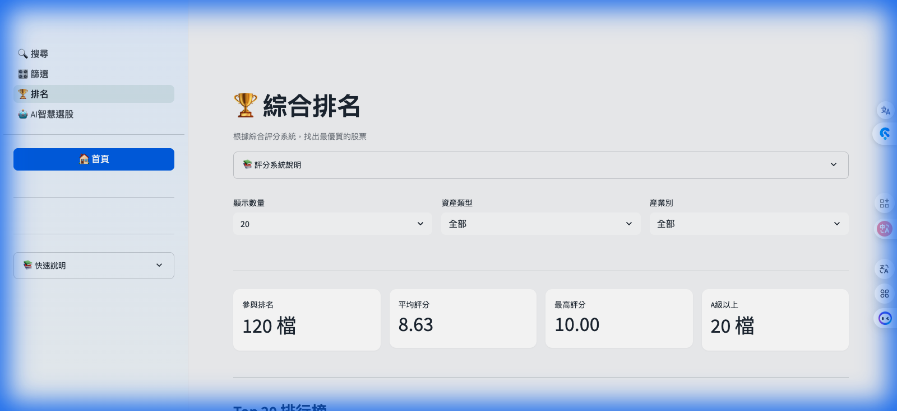
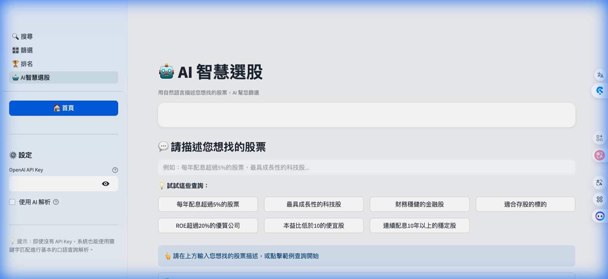

<!-- _class: lead -->

# 📈 台股智選系統

**Python 期末專案報告**

M1427499 陳憶柔

2025/12

---

## 🎯 解決什麼問題？

2,000+

台灣上市櫃股票與 ETF

投資人面臨 **資訊過載**，難以快速找到值得投資的標的

---

## 💡 我們的解決方案

- 🔍 智慧搜尋與篩選
- 📊 11 項財務指標分析
- 🏆 0-10 分綜合評分
- 🤖 AI 自然語言選股

---

## 📈 資料涵蓋

120 檔

精選核心標的（涵蓋台股 85% 市值）

| 類別 | 數量 |
|------|------|
| 台灣 50 成分股 | 50 檔 |
| 中型 100 精選 | 50 檔 |
| 熱門 ETF | 10 檔 |
| 補充熱門股 | 10 檔 |

---

## 🏗️ 系統架構

| 層級 | 說明 |
|------|------|
| **使用者介面** | Streamlit Web App（搜尋/篩選/排名/AI） |
| **業務邏輯** | stock_analyzer 評分、stock_screener 篩選 |
| **資料存取** | Offline-First 架構，讀取本地快取 |
| **資料來源** | FinMind API → robust_indicators_data.csv |

---

## 🔧 評分系統

### 一般個股
| 指標 | 權重 |
|------|------|
| ROE | 40% |
| PE | 30% |
| PB | 15% |
| 負債率 | 15% |

### ETF
| 指標 | 權重 |
|------|------|
| 殖利率 | 80% |
| 配息年數 | 20% |

---

## 📊 四大內建策略

| 策略 | 核心條件 |
|------|---------|
| 🚀 成長股 | 高 ROE、高淨利率 |
| 💎 價值股 | 低 PE、低 PB |
| 💰 高股息 | 高殖利率、穩定配息 |
| ⭐ 優質股 | 財務穩健、低負債 |

---

## 🛠️ 技術應用

| 技術 | 應用 |
|------|------|
| Pandas | 資料處理 |
| Streamlit | Web UI |
| Requests | API 串接 |
| Plotly | 資料視覺化 |

---

## 🖥️ 系統展示 - 首頁

- ✅ 一目了然的市場概況與統計數據
- ✅ 四大核心功能快速導覽

---

## 🔍 搜尋功能

- ✅ 輸入代號即顯示完整財務指標
- ✅ **評分明細**：各指標分數、權重一覽
- ✅ **口語化總評**：自動生成投資建議

---

## 🎛️ 策略篩選

- ✅ 四大策略：成長股、價值股、高股息、優質股
- ✅ 一鍵篩選，快速找到符合條件的標的

---

## 🏆 排名分析

- ✅ 綜合評分 0-10 分即時排行
- ✅ 圖表化呈現產業分佈

---

## 🤖 AI 智慧選股

- ✅ 用自然語言描述需求
- ✅ 系統自動解析條件並篩選

---

<!-- _class: lead -->

## 📝 結語

> 「專注於分析公司的財務體質，
> 幫助投資人找到值得長期持有的好公司。」

# 🙏 謝謝聆聽
