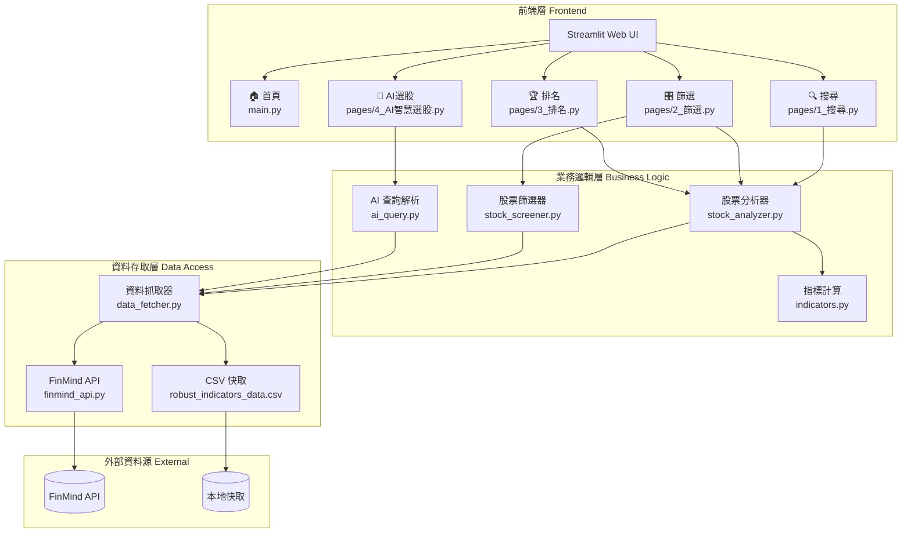
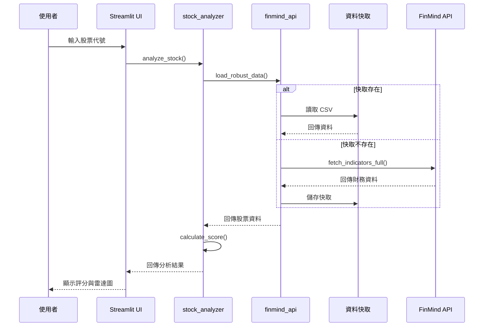
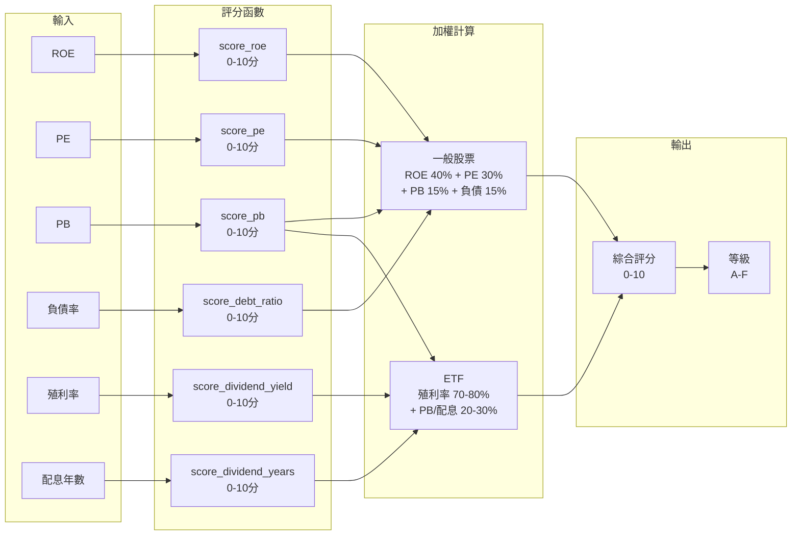
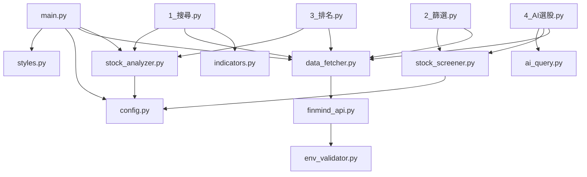

# 台股智選系統 - 系統架構圖

## 整體架構

---

## 資料流程圖

---

## 評分系統架構

---

## 模組依賴關係

---

## 技術棧

| 層級 | 技術 |
|------|------|
| **前端框架** | Streamlit 1.29+ |
| **資料處理** | Pandas, NumPy |
| **視覺化** | Plotly |
| **API 串接** | Requests |
| **環境管理** | python-dotenv |
| **測試框架** | pytest |
| **資料來源** | FinMind API |
